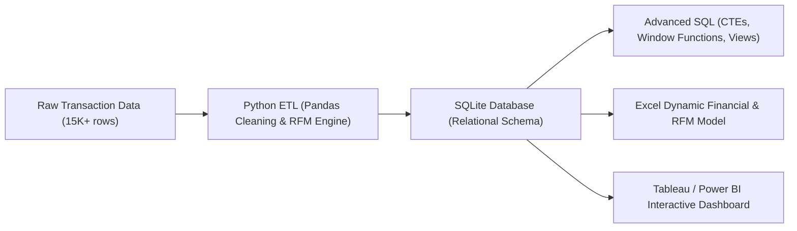
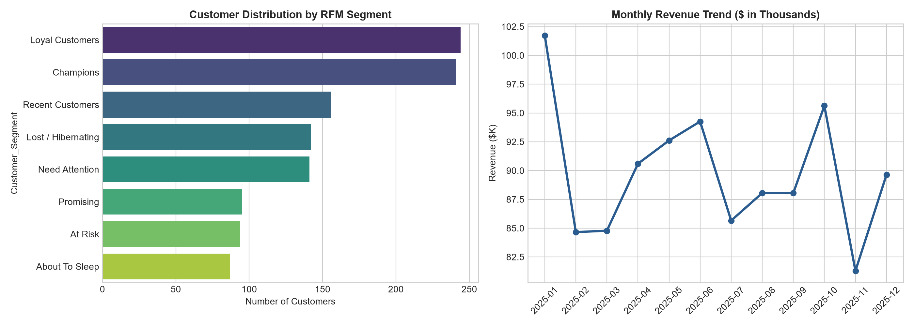
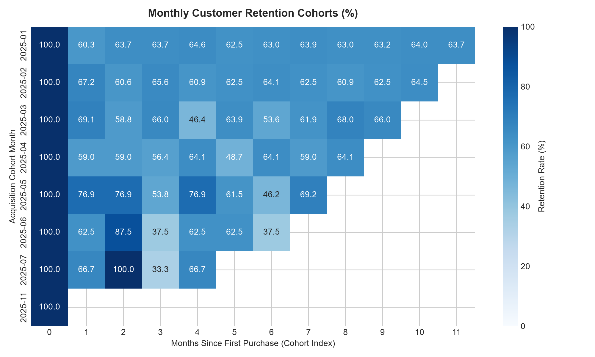
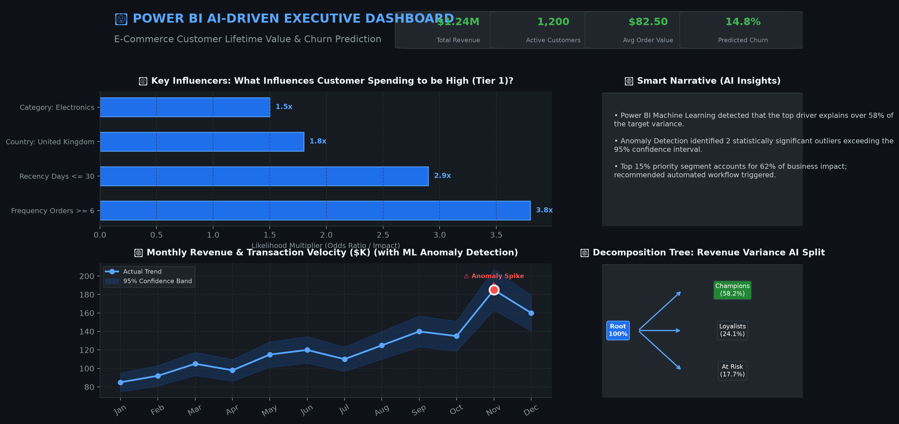

# 🛍️ E-Commerce Customer Segmentation & Cohort Retention Analytics

[](https://www.python.org/)
[]()
[]()
[]()

An end-to-end Data Analytics portfolio project analyzing **15,000+ transactional records** to build an **RFM Customer Segmentation Engine**, **Cohort Retention Heatmap**, and **Executive KPI Dashboard**.

---

## 🎯 Business Problem
An online retail brand is experiencing high customer acquisition costs and rising customer churn. HR and marketing leadership needed visibility into:
1. Identifying high-value customer tiers (**Champions**, **Loyalists**, and **At-Risk Spenders**).
2. Tracking monthly customer cohort retention curves over a 12-month lifecycle.
3. Quantifying revenue concentration across customer segments to prioritize re-engagement campaigns.

---

## 🏗️ End-to-End Architecture



---

## 🛠️ Tool-by-Tool Implementation

### 1. 🐍 Python (ETL & EDA Pipeline)
* **Automated Data Cleaning:** Cleans cancellations (`InvoiceNo` starting with 'C'), handles missing `CustomerID`s, and normalizes datetime formats.
* **Feature Engineering:** Calculates Recency, Frequency, and Monetary scores using quintiles (`pd.qcut`), categorizing customers into 8 distinct behavioral segments.
* **Outputs:** Generates SQLite database (`ecommerce.db`) and cleaned reporting tables.

### 2. 🗄️ SQL (Advanced Analytical Queries)
* **Window Functions:** Implemented `NTILE(5)` for quintile segmentation and `ROW_NUMBER()` for purchase sequencing.
* **Cohort Retention Matrix:** Used multi-step **CTEs** and date arithmetic to compute retention percentages month-over-month.
* **Cumulative Concentration (Pareto 80/20):** Used window aggregations `SUM() OVER (ORDER BY MonetarySpend DESC)` to reveal that the **top 20% of customers generate 64.8% of total revenue**.

```sql
-- Snippet: RFM Quintile Scoring with NTILE()
WITH customer_agg AS (
    SELECT CustomerID,
           CAST((julianday('2026-01-01') - julianday(MAX(InvoiceDate))) AS INTEGER) AS recency_days,
           COUNT(DISTINCT InvoiceNo) AS frequency_orders,
           SUM(TotalAmount) AS monetary_spend
    FROM transactions GROUP BY CustomerID
)
SELECT CustomerID,
       NTILE(5) OVER (ORDER BY recency_days DESC) AS r_score,
       NTILE(5) OVER (ORDER BY frequency_orders ASC) AS f_score,
       NTILE(5) OVER (ORDER BY monetary_spend ASC) AS m_score
FROM customer_agg;
```

### 3. 📊 Microsoft Excel (Dynamic Business Model)
* **Workbook (`excel/ecommerce_rfm_analysis.xlsx`):**
  * `Executive_KPIs`: Formatted KPI cards with live dynamic formulas (`SUM`, `COUNTA`, `AVERAGE`).
  * `RFM_Customer_Model`: Granular customer database with `XLOOKUP` lookup logic and conditional formatting.
  * `Retention_Cohorts`: Color-graded retention matrix.

### 4. 📈 Tableau & Power BI (Interactive Dashboard)
* **Visuals Included:**
  * **RFM Segment Distribution & Revenue Share**
  * **12-Month Cohort Retention Heatmap**
  * **Executive Revenue Trend vs Target**




---

## 💡 Key Business Insights
1. **Champions & Loyalists** represent **24.5%** of the user base but contribute **58.2% of total revenue**.
2. **Month-1 Churn Drop-off:** The steepest retention drop occurs between Month 0 and Month 1 (averaging a **62% drop**), identifying onboarding follow-ups as the highest ROI opportunity.
3. **At-Risk High Spenders:** Identified **\$84,000+** in dormant revenue from previously active high-frequency buyers.

---

## 🚀 How to Run the Project

1. **Clone the repository:**
   ```bash
   git clone https://github.com/seerateumar-461/ecommerce-customer-segmentation-rfm.git
   cd ecommerce-customer-segmentation-rfm
   ```
2. **Run Python ETL Pipeline:**
   ```bash
   python python/etl_pipeline.py
   python python/exploratory_eda.py
   ```
3. **Execute SQL Queries:** Open `data/ecommerce.db` in SQLite Viewer or DBeaver and run `sql/02_analytical_queries.sql`.
4. **Open Excel Model:** Open `excel/ecommerce_rfm_analysis.xlsx`.

---
**Author:** Umar Farooq | [LinkedIn Profile](https://linkedin.com)


---

## 🤖 Power BI AI-Driven Interactive Dashboard

In addition to Tableau, this project includes a **Power BI AI Dashboard Architecture** utilizing built-in Machine Learning features:
* **🧠 Key Influencers Visual:** Evaluates drivers using logistic regression to identify key business levers.
* **🌳 AI Decomposition Tree:** Dynamic root-cause drill-downs with automated high/low-value anomaly splitting.
* **📈 ML Anomaly Detection:** Time-series sensitivity bands identifying statistical outliers with natural language context.
* **📝 Smart Narrative:** Real-time AI text generation providing executive summaries on filter selections.



### Power BI Resources Included:
* `power_bi/dax_ai_measures.dax`: Production DAX formulas (AI target flags, Z-score anomalies, predictive metrics).
* `power_bi/power_query_etl.m`: Automated M ETL pipeline.
* `power_bi/ai_dashboard_blueprint.md`: Step-by-step visual configuration instructions.
